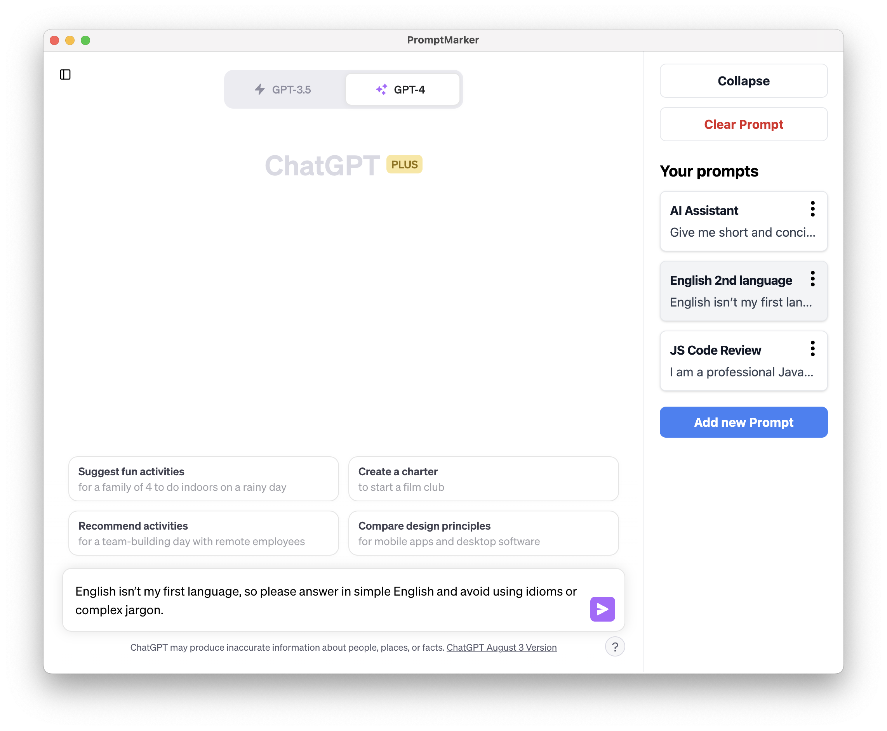

# 🔖 PromptMarker 

**A ChatGPT MacOS app that lets you bookmark and quick add your favourite prompts.**



The app embdeds ChatGPT into a desktop app as a webview, and lets you quickly add and remove stored reusable prompts in a collapsable sidebar. 

### Installation 
- Download PromptMarker from [Gumroad](https://paultreanor.gumroad.com/l/promptmarker) or from [this repo's releases](https://github.com/PaulTreanor/PromptMarker/releases/tag/1.0.0)
- Run the file to install the MacOS app. 

### How to use 
- Log into ChatGPT through the app. 
- Click on the expand icon on the top right of the app to show the sidebar. 
- Add a new prompt 
- Click the settings icon on a prompt to edit or delete it 
- Click on a prompt to add it to ChatGPT's input box

### Implementation
PromptMarker is built on top of Electron, React, Tailwinds, and Vite. 

### Setup (for developers)
**Setup dev env**
```bash
# Download the repo
npm install
```
**Run the app in dev mode**
```bash
npm run dev
```
**Run unit tests**
```bash
npm run test:unit
```

**Build the app**
```bash
npm run build
# Built app will be in /releases directory
```
